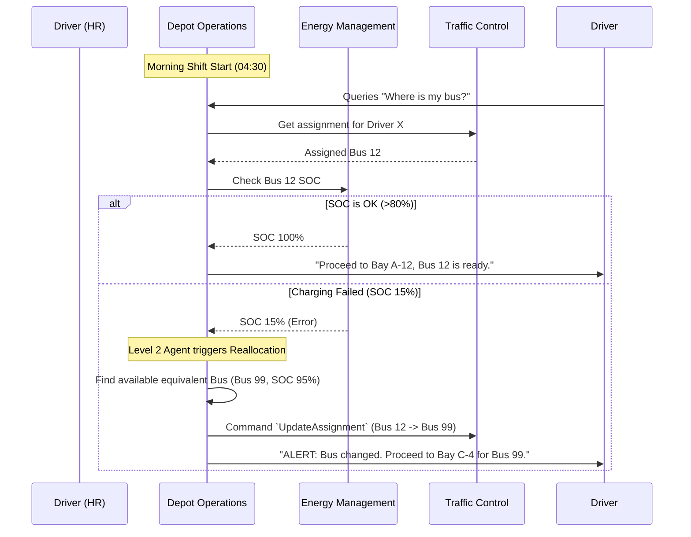

# Depot Operations - Data Model & Flows

## 1. Internal Data Model (State)

### Entity: `DepotAsset`
*   `vehicle_id` (UUID)
*   `current_bay_id` (String) - e.g., "A-14"
*   `readiness_status` (Enum: Ready, Needs_Cleaning, In_Maintenance, Charging, Out_Of_Service)
*   `last_inspection_timestamp` (DateTime)

### Entity: `DepotTask`
*   `task_id` (UUID)
*   `vehicle_id` (UUID)
*   `task_type` (Enum: Clean_Interior, Wash_Exterior, Routine_Check, Move_To_Workshop)
*   `assigned_staff_id` (UUID, Optional)
*   `status` (Enum: Pending, In_Progress, Completed)

## 2. Information Flow (Driver Handover & Reassignment)

