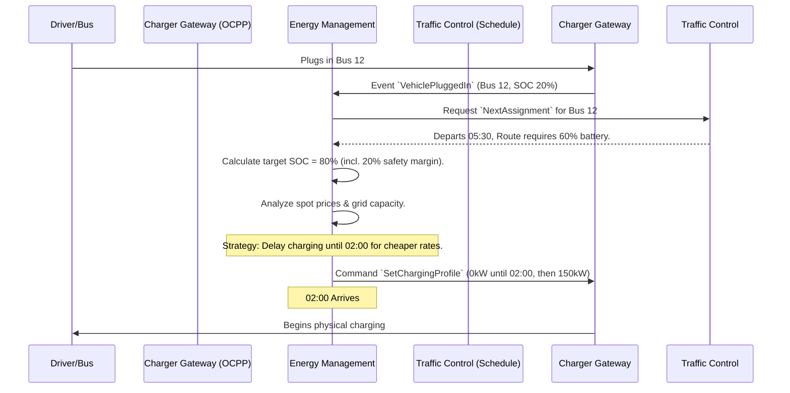

# Energy Management - Data Model & Flows

## 1. Internal Data Model (State)

### Entity: `ChargingSession`
*   `session_id` (UUID)
*   `vehicle_id` (UUID)
*   `charger_id` (String)
*   `start_soc_percentage` (Float)
*   `target_soc_percentage` (Float) - Driven by the next scheduled route.
*   `deadline_timestamp` (DateTime) - When must it be fully charged?
*   `status` (Enum: Plugged_In, Waiting_For_Price, Charging, Suspended_Grid_Limit, Completed, Error)

### Entity: `DepotGridState`
*   `depot_id` (String)
*   `max_capacity_kw` (Int) - Physical limit of the grid connection.
*   `current_draw_kw` (Int) - Sum of all active chargers.
*   `spot_price_matrix` (JSON) - Hourly pricing data for the day.

## 2. Information Flow (Smart Charging)

