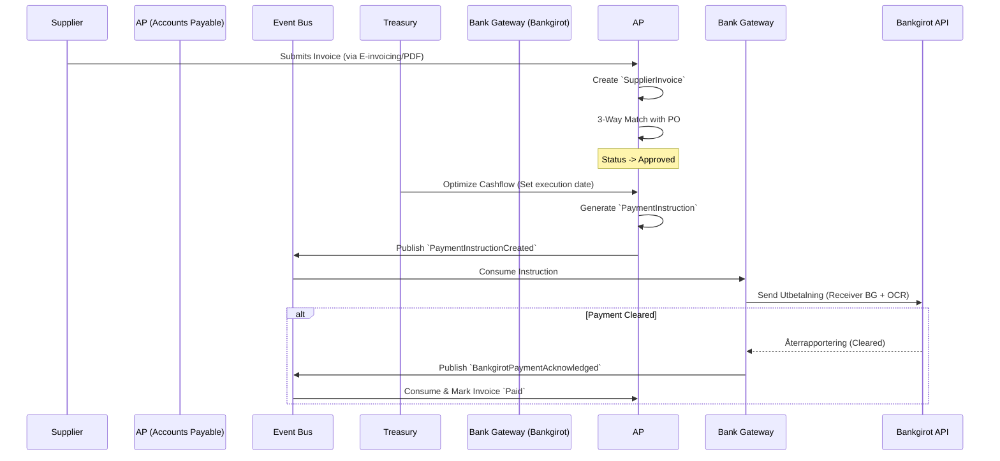

# Accounts Payable (AP) - Data Model & Flows

## 1. Internal Data Model (State)

### Entity: `Supplier` (Business Partner)
*   `supplier_id` (UUID)
*   `legal_name` (String)
*   `org_number` (String) - Critical for fraud prevention and legal reporting.
*   `vat_number` (String)
*   `payment_terms_days` (Int)
*   `bankgiro_number` (String) - Primary routing address for Bankgirot payments.
*   `iban` (String, Optional) - For international suppliers.

### Entity: `PurchaseOrder` (PO)
*   `po_id` (UUID)
*   `supplier_id` (UUID)
*   `domain_owner` (String) - e.g., 'energy', 'maintenance'
*   `total_approved_amount` (Decimal)
*   `status` (Enum: Open, Fulfilled, Closed)

### Entity: `SupplierInvoice`
*   `invoice_id` (UUID)
*   `supplier_id` (UUID)
*   `invoice_number` (String) - The supplier's reference.
*   `ocr_reference` (String) - The OCR to use when paying via Bankgirot.
*   `issue_date` (Date)
*   `due_date` (Date)
*   `total_amount` (Decimal)
*   `po_reference` (UUID, Optional)
*   `status` (Enum: Received, Matched, Approved, Scheduled, Paid, Disputed)

### Entity: `PaymentInstruction`
*   `instruction_id` (UUID)
*   `invoice_id` (UUID)
*   `target_bankgiro` (String)
*   `amount` (Decimal)
*   `ocr_reference` (String)
*   `execution_date` (Date)
*   `status` (Enum: Pending_Gateway, Sent_To_Bankgirot, Confirmed)

## 2. Information Flow (Inbound Expense & Outbound Payment)

