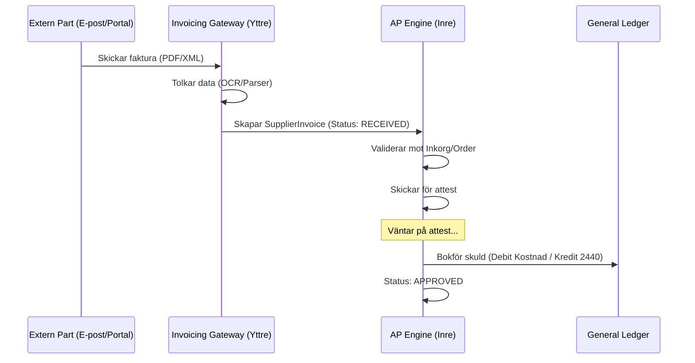

# Accounts Payable - Data Model

Denna modell beskriver hur systemet hanterar inkommande leverantörsfakturor och utbetalningsflöden (Yttre till Inre ringen).

## 1. Entiteter

### Entity: `Vendor` (Leverantör)
*   `id`: UUID (Primary Key)
*   `name`: String (Namn på företaget)
*   `org_number`: String (Organisationsnummer)
*   `bank_account`: String (IBAN/Bankgiro)
*   `category`: Enum (FORDON, BRÄNSLE, PERSONAL, ÖVRIGT)
*   `default_terms`: Integer (Standard betalningsvillkor i dagar)

### Entity: `SupplierInvoice` (Leverantörsfaktura)
*   `id`: UUID
*   `vendor_id`: UUID (FK till Vendor)
*   `invoice_number`: String (Leverantörens fakturanummer)
*   `ocr_reference`: String
*   `amount_excl_vat`: Decimal
*   `vat_amount`: Decimal
*   `total_amount`: Decimal
*   `currency`: String (Default: SEK)
*   `status`: Enum (RECEIVED, PENDING_APPROVAL, APPROVED, PAID, REJECTED)
*   `due_date`: Date
*   `approval_id`: UUID (Referens till attest-logg)

## 2. Informationsflöde (Inkommande Faktura)

## 3. Kontoplan (Standardkonton)
*   **2440:** Leverantörsskulder
*   **2641:** Ingående moms (25%)
*   **4XXX:** Material- och varukostnader
*   **5XXX/6XXX:** Övriga externa kostnader
