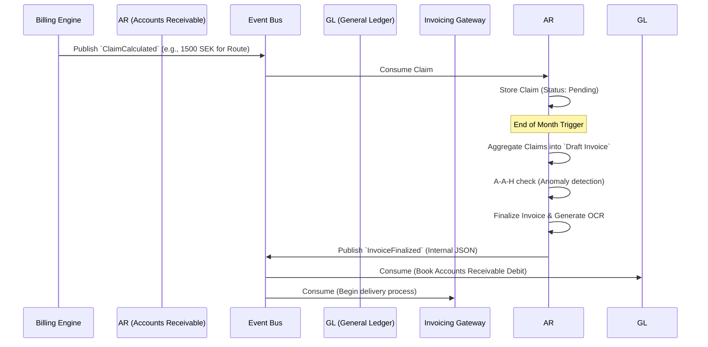

# Accounts Receivable (AR) - Data Model & Flows

## 1. Internal Data Model (State)

While inspired by Odoo/ERPNext, this model is streamlined for an event-driven architecture.

### Entity: `CompanyProfile` (Global Master Data)
*Note: This represents Kalles Buss itself and is likely mastered in the General Ledger or a global config, but is referenced by AR to construct legal invoices.*
*   `company_id` (UUID)
*   `legal_name` (String) - e.g., "Kalles Buss AB"
*   `org_number` (String) - The Swedish organizational number (e.g., 556000-0000)
*   `vat_number` (String)
*   `receiving_bank_accounts` (List[BankAccount]) - Active Bankgiro/IBANs for receiving payments.

### Entity: `Customer` (Business Partner)
*   `customer_id` (UUID) - Internal unique identifier
*   `legal_name` (String) - e.g., "Storstockholms Lokaltrafik AB"
*   `org_number` (String) - Mandatory primary legal identifier.
*   `vat_number` (String)
*   `billing_currency` (String) - e.g., SEK
*   `payment_terms_days` (Int) - e.g., 30
*   `known_bank_accounts` (List[BankAccount]) - Tracked IBANs/BGs used by this customer to pay us (vital for AI Level 2 payment matching).
*   `current_ar_balance` (Decimal) - The current outstanding debt.

### Entity: `BankAccount` (Value Object)
*   `account_type` (Enum: IBAN, Bankgiro, Plusgiro)
*   `account_number` (String)
*   `bic_swift` (String, Optional)
*   `is_active` (Boolean) - Supports organizational changes over time.

### Entity: `Claim` (Underlag)
*   `claim_id` (UUID)
*   `customer_id` (UUID)
*   `source_domain` (String) - e.g., 'traffic', 'sla-engine'
*   `description` (String) - e.g., "Route 676, Bus 12, 2026-03-24"
*   `amount` (Decimal)
*   `status` (Enum: Pending, Invoiced, Disputed, Voided)

### Entity: `Invoice`
*   `invoice_id` (UUID)
*   `invoice_number` (String) - e.g., "KB-2026-001" (Generated on finalization)
*   `customer_id` (UUID)
*   `issue_date` (Date)
*   `due_date` (Date)
*   `line_items` (List[Claim])
*   `total_amount` (Decimal)
*   `ocr_reference` (String)
*   `status` (Enum: Draft, Finalized, Sent, Paid, Overdue)

## 2. Information Flow (Outbound Revenue)

