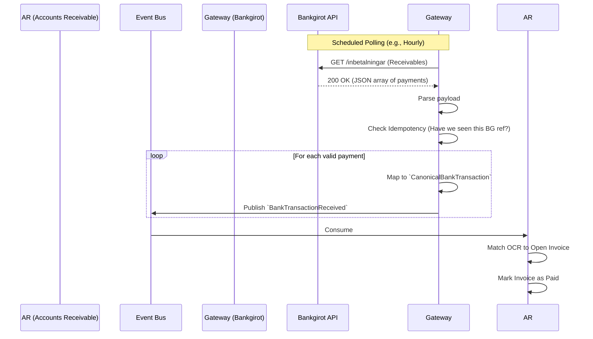

# Bank Gateway - Data Model & Flows

## 1. Internal Data Model (State)

The Bank Gateway does not hold business state (like invoice balances), but it must hold integration state to ensure exactly-once processing.

### Entity: `BankgirotProfile` (Our Configuration)
*   `company_id` (UUID) - Links to Kalles Buss Master Data
*   `our_bankgiro_number` (String) - e.g., "123-4567"
*   `api_endpoint` (String)
*   `authentication_profile` (String) - Reference to GCP Secret Manager for API keys/mTLS certs.

### Entity: `ApiSyncJob` (Idempotency Tracker)
*   `job_id` (UUID)
*   `job_type` (Enum: Fetch_Inbetalningar, Send_Utbetalningar, Fetch_Återrapportering)
*   `execution_timestamp` (DateTime)
*   `bankgirot_batch_id` (String) - The external ID provided by Bankgirot.
*   `status` (Enum: Processing, Success, Failed)
*   `records_processed` (Int)

### Entity: `CanonicalBankTransaction` (The Output)
*This is the standardized event payload emitted to the Event Bus.*
*   `transaction_id` (UUID)
*   `bankgirot_reference` (String) - The unique ID from Bankgirot to prevent double-counting.
*   `direction` (Enum: Inbound, Outbound)
*   `amount` (Decimal)
*   `currency` (String) - Usually SEK for Bankgirot.
*   `counterparty_bankgiro` (String, Optional)
*   `ocr_reference` (String, Optional)
*   `free_text_reference` (String, Optional)
*   `transaction_date` (Date)

## 2. Information Flow (Bankgirot Integration)

