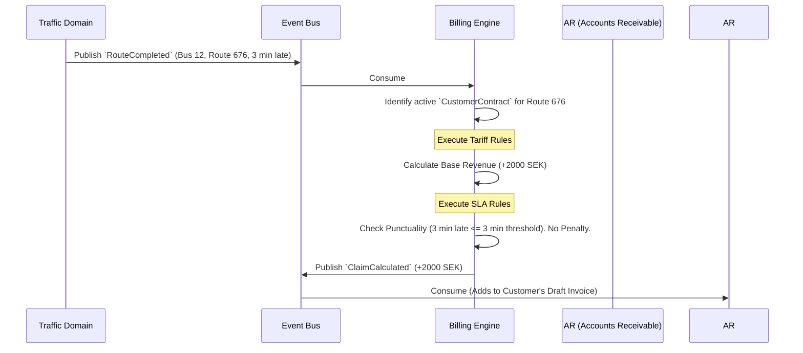

# Billing & Rating Engine - Data Model & Flows

## 1. Internal Data Model (State)

### Entity: `CustomerContract`
*   `contract_id` (UUID)
*   `customer_id` (UUID) - Links to AR Customer
*   `region` (String) - e.g., "Stockholm_Nord", "Västra_Götaland"
*   `valid_from` (Date)
*   `valid_to` (Date)
*   `status` (Enum: Draft, Active, Expired)

### Entity: `TariffRule`
*   `rule_id` (UUID)
*   `contract_id` (UUID)
*   `event_trigger` (String) - e.g., `traffic.route.completed`
*   `condition` (Expression/JSONLogic) - e.g., `bus.propulsion == 'electric'`
*   `payout_formula` (Expression) - e.g., `route.base_price + (route.actual_km * contract.km_rate)`

### Entity: `SLARule` (Penalties & Bonuses)
*   `sla_id` (UUID)
*   `contract_id` (UUID)
*   `metric` (Enum: Punctuality, Cleanliness, Cancelled_Trip)
*   `tolerance_threshold` (Int) - e.g., 3 (minutes late allowed)
*   `penalty_amount` (Decimal)

### Entity: `CalculatedClaim`
*   `claim_id` (UUID)
*   `contract_id` (UUID)
*   `source_event_id` (UUID) - The telemetry event that triggered this.
*   `amount` (Decimal) - Can be positive (revenue) or negative (penalty).
*   `description` (String) - Human-readable explanation.
*   `evidence_payload` (JSON) - Snapshot of GPS/time data.

## 2. Information Flow (Operation to Revenue)

