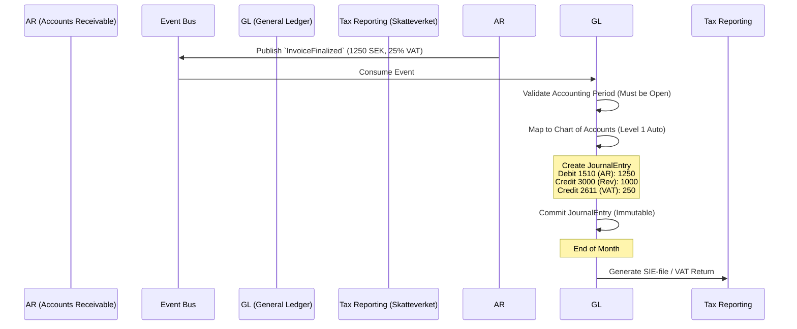

# General Ledger (GL) - Data Model & Flows

## 1. Internal Data Model (State)

### Entity: `ChartOfAccounts` (Kontoplan)
*   `account_id` (String) - e.g., "1930" (Bank), "1510" (AR), "3000" (Revenue)
*   `name` (String)
*   `account_type` (Enum: Asset, Liability, Equity, Revenue, Expense)
*   `vat_code` (String, Optional)

### Entity: `AccountingPeriod`
*   `period_id` (UUID)
*   `start_date` (Date)
*   `end_date` (Date)
*   `status` (Enum: Open, Closed)

### Entity: `JournalEntry` (Verifikat)
*   `entry_id` (UUID)
*   `source_event_id` (UUID) - Link to the event that caused this entry (Traceability).
*   `source_domain` (String) - e.g., 'AR', 'AP'
*   `booking_date` (Date)
*   `description` (String)
*   `lines` (List[JournalLine])
*   `status` (Enum: Draft, Posted)

### Entity: `JournalLine`
*   `line_id` (UUID)
*   `account_id` (String)
*   `amount` (Decimal) - Positive for Debit, Negative for Credit.
*   `dimension_cost_center` (String, Optional) - e.g., "Depot_Norrtälje"
*   `dimension_vehicle` (String, Optional) - e.g., "Bus_104"

## 2. Information Flow (Event to Ledger)

