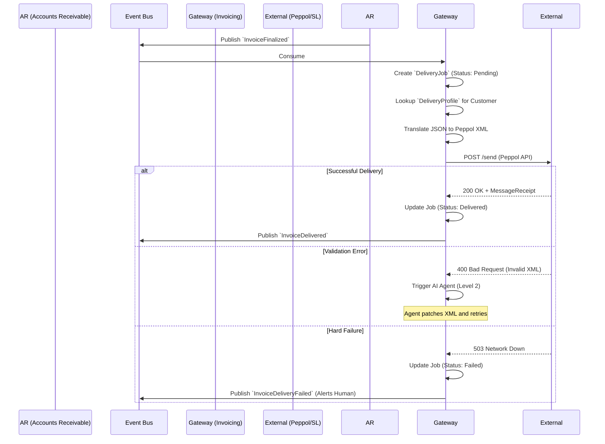

# Invoicing Gateway - Data Model & Flows

## 1. Internal Data Model (State)

The Invoicing Gateway is highly stateless regarding business logic, but it must maintain state for delivery jobs.

### Entity: `DeliveryProfile` (Customer Preferences)
*   `customer_id` (UUID) - Linked to AR's Customer
*   `preferred_format` (Enum: Peppol_BIS_3, PDF, EDIFACT)
*   `endpoint_address` (String) - e.g., Peppol ID (0007:5560000000) or Email
*   `routing_rules` (JSON) - Specific mapping overrides for this customer.

### Entity: `DeliveryJob` (The Outbox)
*   `job_id` (UUID)
*   `invoice_id` (UUID) - Reference to AR's Invoice
*   `payload_canonical` (JSON) - The original data from AR
*   `payload_translated` (String/Blob) - The generated XML/PDF
*   `status` (Enum: Pending, Translating, Sending, Delivered, Failed)
*   `retry_count` (Int)
*   `external_receipt_id` (String) - Tracking ID from the Peppol Access Point.

## 2. Information Flow (Delivery & Acknowledgement)

