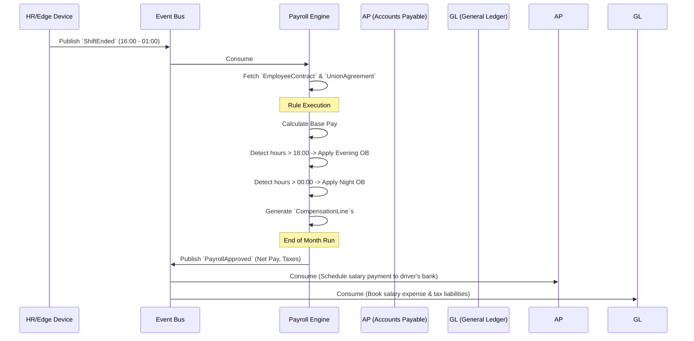

# Payroll Engine - Data Model & Flows

## 1. Internal Data Model (State)

### Entity: `UnionAgreement` (Kollektivavtal)
*   `agreement_id` (String) - e.g., "Kommunal_Buss_2025"
*   `ob_rules` (JSON) - Matrix defining time windows and percentage multipliers.
*   `split_shift_compensation` (Decimal) - Fixed rate for split shifts.
*   `overtime_threshold_weekly` (Int) - e.g., 40 hours.

### Entity: `EmployeeContract`
*   `employee_id` (UUID) - Links to Master HR data
*   `agreement_id` (String) - Which union agreement applies.
*   `base_monthly_salary` (Decimal)
*   `employment_type` (Enum: FullTime, PartTime, Hourly)

### Entity: `TimeEntry` (Normalized Shift)
*   `entry_id` (UUID)
*   `employee_id` (UUID)
*   `actual_start` (DateTime)
*   `actual_end` (DateTime)
*   `unpaid_break_minutes` (Int)
*   `status` (Enum: Raw, Agent_Adjusted, Human_Verified, Locked_For_Payroll)

### Entity: `CompensationLine` (The output of the rules engine)
*   `line_id` (UUID)
*   `employee_id` (UUID)
*   `payroll_month` (String) - e.g., "2026-03"
*   `pay_type` (Enum: BasePay, Overtime, OB_Evening, OB_Weekend, SickDeduction)
*   `amount` (Decimal)

## 2. Information Flow (Time to Money)

