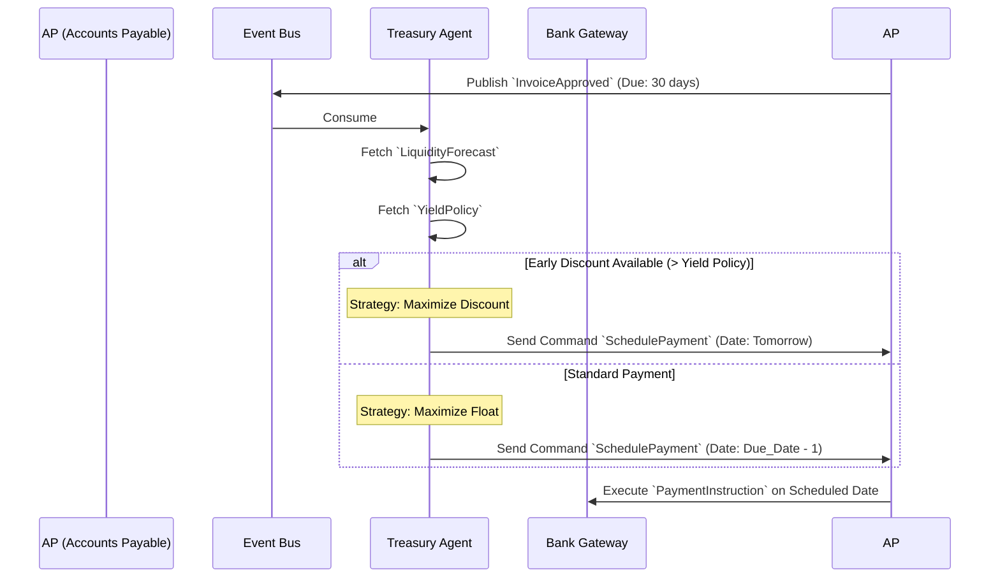

# Treasury & Liquidity - Data Model & Flows

## 1. Internal Data Model (State)

Treasury is highly analytical. Its state is primarily composed of projections and optimization policies.

### Entity: `BankBalanceSnapshot`
*   `account_id` (String) - e.g., Kalles Buss main SEB account
*   `timestamp` (DateTime)
*   `cleared_balance` (Decimal)
*   `pending_transactions` (Decimal)

### Entity: `LiquidityForecast`
*   `forecast_id` (UUID)
*   `generation_date` (DateTime)
*   `horizon_days` (Int) - e.g., 30
*   `projected_inflows` (Decimal)
*   `projected_outflows` (Decimal)
*   `lowest_projected_balance` (Decimal)
*   `risk_status` (Enum: Healthy, Warning, Critical)

### Entity: `YieldPolicy` (Agent Configuration)
*   `policy_id` (UUID)
*   `current_bank_interest_rate` (Decimal) - e.g., 3.5%
*   `cost_of_capital` (Decimal)
*   `early_payment_threshold_yield` (Decimal) - If a supplier discount yields > this %, pay early.

## 2. Information Flow (Payment Optimization)

