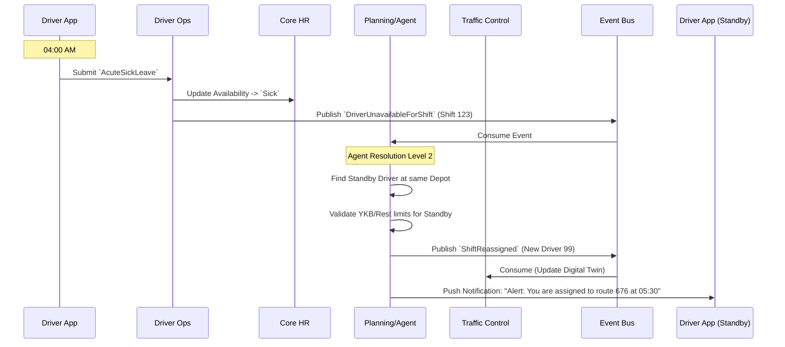

# HR Domain - Data Model & Flows

## 1. Internal Data Model (State)

### Entity: `EmployeeProfile` (Core HR)
*   `employee_id` (UUID)
*   `home_depot_id` (String) - e.g., "Norrtälje"
*   `employment_status` (Enum: Active, Suspended, Terminated)
*   `certifications`:
    *   `drivers_license_expiry` (Date)
    *   `ykb_expiry` (Date)
    *   `medical_clearance_expiry` (Date)
*   `current_availability` (Enum: Available, On_Leave, Sick)

### Entity: `ShiftRoster` (Workforce Planning)
*   `shift_id` (UUID)
*   `employee_id` (UUID)
*   `date` (Date)
*   `planned_start` (DateTime)
*   `planned_end` (DateTime)
*   `assigned_trips` (List[UUID]) - Links to Traffic `Trip`
*   `status` (Enum: Draft, Published, Acknowledged, Executing, Completed)

### Entity: `DailyTimeLog` (Driver Operations)
*   `log_id` (UUID)
*   `employee_id` (UUID)
*   `shift_id` (UUID)
*   `events` (List[TimeEvent]):
    *   `event_type` (Enum: Clock_In, Driving_Start, Rest_Start, Clock_Out)
    *   `timestamp` (DateTime)
*   `accumulated_driving_minutes` (Int) - Tracks the 4.5h EU rule.

## 2. Information Flow (The 04:00 AM Sick Call)

