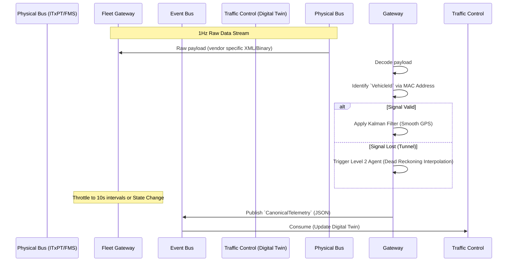

# Fleet Gateway - Data Model & Flows

## 1. Internal Data Model (State)

The Gateway maintains minimal state, mostly focused on device configuration and the "last known value" to calculate deltas.

### Entity: `EdgeDeviceRegistration`
*   `device_mac_address` (String) - Hardware ID.
*   `assigned_vehicle_id` (UUID) - Links to Kalles Buss internal asset.
*   `vendor_protocol` (Enum: ITxPT, Standard_FMS, Volvo_API)
*   `last_seen_timestamp` (DateTime)

### Entity: `CanonicalTelemetry` (The Output Event)
*This is the clean, internal representation published to the Kalles Buss Event Bus.*
*   `vehicle_id` (UUID)
*   `timestamp` (DateTime)
*   `location`:
    *   `latitude` (Float)
    *   `longitude` (Float)
    *   `is_interpolated` (Boolean) - True if the Level 2 Agent guessed this due to signal loss.
*   `kinematics`:
    *   `speed_kmh` (Float)
    *   `heading_degrees` (Int)
*   `hardware_state`:
    *   `doors_open` (Boolean)
    *   `engine_running` (Boolean)
    *   `soc_percentage` (Float) - State of Charge (for EVs)
    *   `odometer_meters` (Int)

## 2. Information Flow (Hardware to Event Bus)

