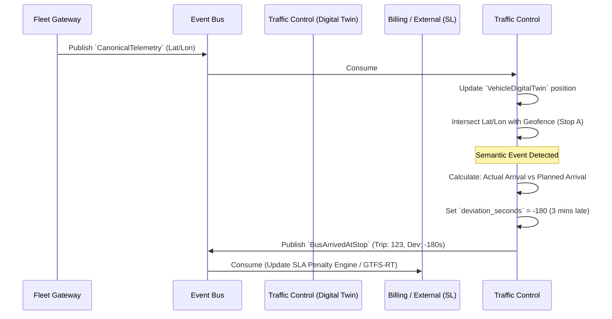

# Traffic Control - Data Model & Flows

## 1. Internal Data Model (State)

This model represents the semantic state of the operation, not the hardware.

### Entity: `VehicleDigitalTwin`
*   `vehicle_id` (UUID)
*   `current_assignment` (UUID, Optional) - Link to an active `Trip`.
*   `logical_location` (Enum: At_Depot, On_Route, At_Stop, Maintenance)
*   `current_coordinate` (Lat/Lon)
*   `status` (Enum: Available, In_Service, Out_Of_Service, Emergency)

### Entity: `Trip` (The Planned Journey)
*   `trip_id` (UUID) - Matches GTFS standard `trip_id`.
*   `route_id` (String) - e.g., "676"
*   `vehicle_id` (UUID)
*   `driver_id` (UUID)
*   `scheduled_start` (DateTime)
*   `scheduled_end` (DateTime)
*   `status` (Enum: Scheduled, Active, Completed, Cancelled)

### Entity: `TripStopEvent`
*   `stop_id` (String) - e.g., "Tekniska Högskolan"
*   `trip_id` (UUID)
*   `planned_arrival` (DateTime)
*   `actual_arrival` (DateTime, Nullable)
*   `deviation_seconds` (Int) - Negative is late, Positive is early.

## 2. Information Flow (Digital Twin & Deviations)

